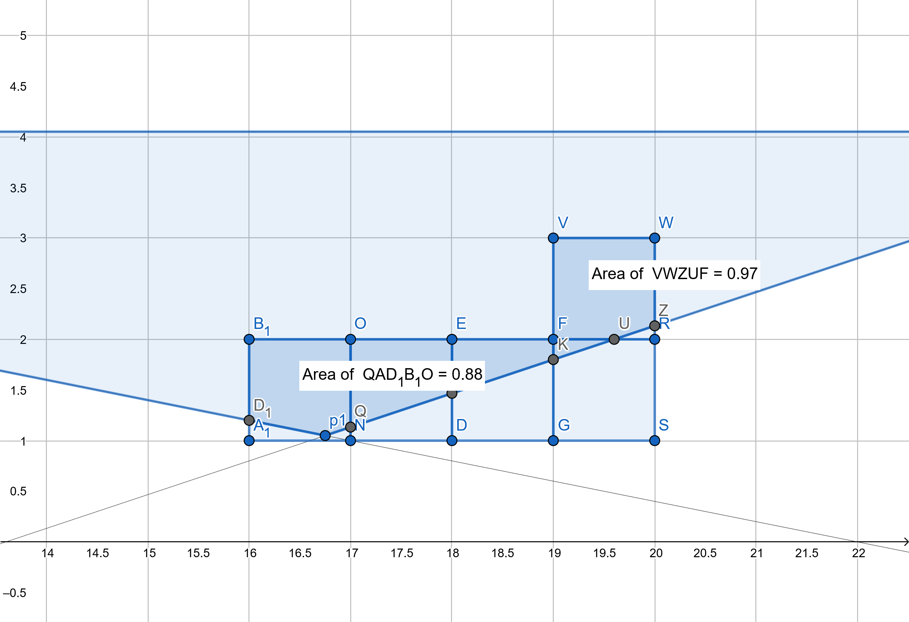
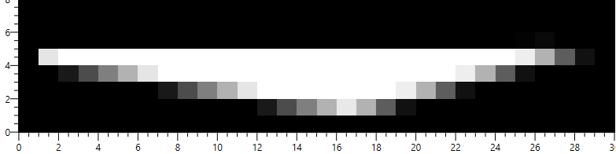
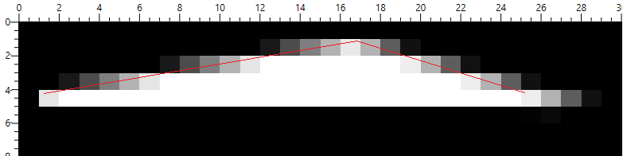

# Triangle rasterization with exact antialising on pure C#

This is a C# WPF demo application with implemented on pure C# written triangle rasterization algorithm with exact sub-pixel antialising calculations. Color of a pixel determines from an area of triange covers on that pixel. Only grey levels are supported. No colors.

## How does it work?

* Implementation of [Bresenham Triangle Rasterization](http://www.sunshine2k.de/coding/java/TriangleRasterization/TriangleRasterization.html#algo3) with additional antialising.
* Triangle sides are determined using [bresenham](https://en.wikipedia.org/wiki/Bresenham%27s_line_algorithm)
* Application visualizes a resilt in interface as shown on screenshot below

* InteractiveDataDisplay library was used for visualization.
* Geometrical calculations is on [GeoGebra](https://ggbm.at/ytbgvphv)

## How to install and use.

A solution was made in Visual Studio 2017. For using just compile and run it.

There is need to change visualization according to following image

## License
#### The MIT License (MIT)
Copyright (c) 2017 Michael Straßburger

Permission is hereby granted, free of charge, to any person obtaining a copy of this software and associated documentation files (the "Software"), to deal in the Software without restriction, including without limitation the rights to use, copy, modify, merge, publish, distribute, sublicense, and/or sell copies of the Software, and to permit persons to whom the Software is furnished to do so, subject to the following conditions:

The above copyright notice and this permission notice shall be included in all copies or substantial portions of the Software.

THE SOFTWARE IS PROVIDED "AS IS", WITHOUT WARRANTY OF ANY KIND, EXPRESS OR IMPLIED, INCLUDING BUT NOT LIMITED TO THE WARRANTIES OF MERCHANTABILITY, FITNESS FOR A PARTICULAR PURPOSE AND NONINFRINGEMENT. IN NO EVENT SHALL THE AUTHORS OR COPYRIGHT HOLDERS BE LIABLE FOR ANY CLAIM, DAMAGES OR OTHER LIABILITY, WHETHER IN AN ACTION OF CONTRACT, TORT OR OTHERWISE, ARISING FROM, OUT OF OR IN CONNECTION WITH THE SOFTWARE OR THE USE OR OTHER DEALINGS IN THE SOFTWARE.
